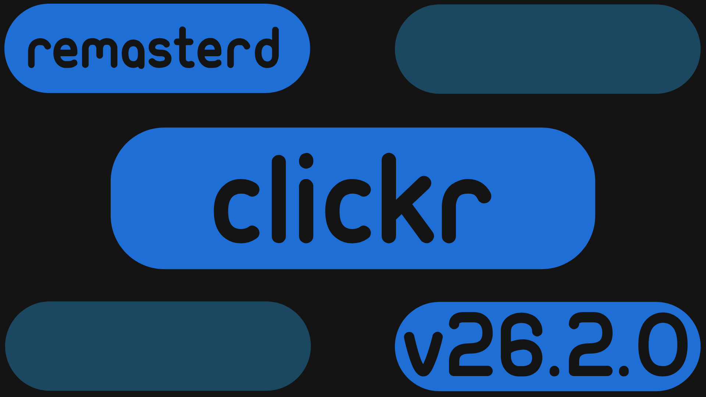

# Clickr

   
Clickr (pronouced click-er) is a **Node.js app** that you can use on **any device** with a browser.
With Clickr you can **fully costomize** a clock, the date, and your local weather (for US only).

---

## Whats to come

Our insights with Clickr are to be able to control your PC, and Home Assistant Dashboard with old phones, tablets, or even a old computer.  

---
To install Clickr, Please open the realase notes label V26.2.0 and download the exe. After downloading open the file on a Windows computer and follow the prompts. Then the Clickr server should be downloaded.

To open a client, navigate to the Clients tab in the server, then press add a device. Scan the QR code or navigate to the URL listed to the right on any browser. *Note: This will only work if both the device the server and client are on are on the SAME WIFI!*

---

To change the settings click the settings icon and navigate throught the menus to see all the settings, Make sure you press save or your settings *Will Not* Save.
